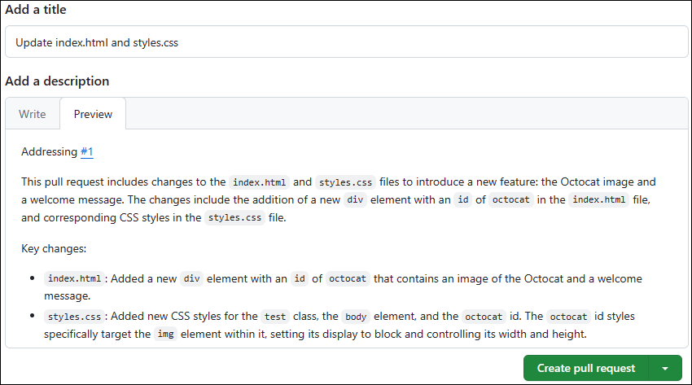

---
lab:
  title: Implementación del flujo de trabajo con GitHub
  module: Develop with DevOps
---

# Laboratorio 02: implementación del flujo de trabajo con GitHub

## Tiempo estimado: 30 minutos

## Escenario

Recuerde el escenario de este módulo, en el cual trabaja para una empresa de desarrollo de software en el sector minorista que planea migrar una tienda en línea de una aplicación antigua a una nueva denominada eShopOnWeb. Dado que ha decidido usar Git y GitHub para facilitar la administración del ciclo de vida de las aplicaciones, este laboratorio le ofrece la oportunidad de empezar por bifurcar un repositorio existente, configurarlo, crear una incidencia, crear una rama, actualizar archivos en la rama, crear y combinar una solicitud de incorporación de cambios, cerrar la incidencia y validar los cambios.

## Objetivos

En este laboratorio, aprenderá a:

- Implementación y administración de repositorios con GitHub

> **Nota:** Para este y los laboratorios posteriores, use la misma cuenta de GitHub que creó para el primer laboratorio.

## Requisitos previos

- [Laboratorio 01: planificación y gestión ágiles mediante GitHub](01-agile-planning-management-using-github.md) completado

## Ejercicio 1: Implementación y administración de repositorios con GitHub

En este ejercicio, bifurcará un repositorio de Git y lo administrará mediante GitHub.

> **Importante:** El uso de la característica de solicitud de incorporación de cambios de GitHub Copilot es completamente opcional. Para usar esta característica, debe ser miembro de una empresa con una suscripción de **Copilot Enterprise**. Puede omitir los pasos que implican la característica de solicitud de incorporación de cambios de GitHub Copilot si no tiene acceso a ella. Si desea obtener más información sobre la característica de solicitud de incorporación de cambios de GitHub Copilot, consulte [Acerca de los resúmenes de solicitudes de incorporación de cambios de Copilot](https://docs.github.com/en/enterprise-cloud@latest/copilot/github-copilot-enterprise/copilot-pull-request-summaries/about-copilot-pull-request-summaries).

> **Nota:** Ha creado un nuevo repositorio en el primer laboratorio de nuestro curso. En este laboratorio, comenzará bifurcando un repositorio existente. Una bifurcación es un repositorio que comparte la configuración de código y visibilidad con un repositorio ascendente existente. Este enfoque se usa con frecuencia al desarrollar actualizaciones para proyectos de código abierto o en escenarios en los que el acceso de escritura al repositorio ascendente no está disponible. Para obtener más información, consulte [Trabajar con bifurcaciones](https://docs.github.com/en/pull-requests/collaborating-with-pull-requests/working-with-forks).

El ejercicio consta de las tareas siguientes:

- Tarea 1: Bifurcar un repositorio de GitHub
- Tarea 2: Configurar un repositorio de GitHub
- Tarea 3: Crear una incidencia
- Tarea 4: Crear una rama
- Tarea 5: Actualizar archivos en la rama
- Tarea 6: Creación y combinación de una solicitud de incorporación de cambios
- Tarea 7: Cerrar la incidencia
- Tarea 8: Validar los cambios

### Tarea 1: Bifurcar un repositorio de GitHub

1. Inicie un explorador web y vaya a la página principal de [GitHub](https://github.com).
1. Cuando se le pida que se autentique, inicie sesión con su cuenta de usuario de GitHub.
1. Abra otra pestaña en la misma ventana del explorador y vaya al repositorio [Spoon-Knife](https://github.com/octocat/Spoon-Knife).
1. En la página del repositorio **Spoon-Knife**, seleccione **Bifurcación**.
1. En la página **Crear una nueva bifurcación**, asegúrese de que la entrada de lista desplegable **Propietario** muestra el nombre de usuario de GitHub, acepte la entrada predeterminada **Spoon-Knife** en el cuadro de texto **Nombre del repositorio** y deje activada la casilla **Copia solo de la rama principal**, y, a continuación, seleccione **Crear bifurcación**.

   > **Nota:** La sesión del explorador se redirigirá automáticamente al repositorio recién bifurcado.

### Tarea 2: Configurar un repositorio de GitHub

1. En la página de repositorio **Spoon-Knife** bifurcado, en la barra de herramientas, seleccione **Configuración**.
1. En la sección **General** de la pestaña **Configuración**, tenga en cuenta que la rama predeterminada está establecida en **principal*.
1. Vaya al área **Características** de la sección **General** y habilite la casilla **Incidencias**.
1. En el menú de navegación del lado izquierdo, en la agrupación **Código y automatización**, seleccione la entrada **Pages**.
1. En el panel **GitHub Pages**, en la sección Rama, cambie la entrada **Ninguna** de la lista desplegable a **principal** y, a continuación, seleccione **Guardar**.

   > **Nota:** Las GitHub Pages publicará automáticamente el contenido del repositorio en un sitio accesible a través de la dirección URL `https://<your_GitHub_username>.github.io/Spoon-Knife/`.

1. En el panel **GitHub Pages**, seleccione el botón **Visitar sitio**. Esto abrirá automáticamente otra pestaña del explorador web y mostrará la página que representa el contenido actual del archivo index.html.

   > **Nota:** Es posible que tenga que esperar unos minutos antes de que el botón **Visitar sitio** y la página estén disponibles.

   > **Nota:** Realice los pasos restantes de esta tarea si completó el primer laboratorio.

1. De nuevo en la página de repositorio **Spoon-Knife** bifurcado, en la barra de herramientas, seleccione **Proyectos**.
1. En el panel **Nuevos proyectos**, seleccione **Vincular un proyecto** y, en el menú desplegable, seleccione **Vincular un proyecto existente**.
1. En la lista de proyectos existentes, seleccione **DevOps Core Intro Project**.

### Tarea 3: Crear una incidencia

1. En la página de **Spoon-Knife**, seleccione la pestaña **Incidencias**.
1. En la página **Incidencias**, seleccione **Nueva incidencia**.
1. En el cuadro de texto **Agregar un título**, escriba **index.html parece bastante austero**.
1. En el cuadro de texto **Agregar una descripción**, escriba **el archivo index.html puede tener un toque moderno**.
1. En el panel actual, en la sección Usuario asignado, seleccione **Agregar usuario asignado…** y, en la sección **Sugerencias**, seleccione el nombre de usuario de GitHub.
1. Seleccione el icono de engranaje situado junto a la entrada **Etiquetas** y, en la lista desplegable, seleccione **mejora**.
1. Seleccione el icono de engranaje situado junto a la entrada **Proyectos** y, en la lista desplegable, seleccione **DevOps Core Intro Project**.
1. Seleccione **Enviar nueva incidencia**.
1. En el panel **index.html parece bastante austero**, en la sección **Proyectos**, establezca **Estado** en **En curso**.
1. En la página de **Spoon-Knife**, seleccione la pestaña **Proyectos**.
1. En la página **Nuevos proyectos**, seleccione **DevOps Core Intro Project**.
1. En la vista de panel de **DevOps Core Intro Project**, revise la columna **En curso** y observa que incluye la incidencia recién creada.

### Tarea 4: Crear una rama

1. Vuelva a la pestaña **Código**.
1. En la esquina superior izquierda de la página, seleccione la entrada **principal** para mostrar la lista desplegable **Cambiar ramas/etiquetas**.
1. En el cuadro de texto **Buscar o crear una rama...**, escriba **actualizar index.html** y, a continuación, seleccione **Crear rama: actualizar index.html desde la entrada "principal"** para crear una nueva rama.

   > **Nota:** Esto hará automáticamente que la rama recién creada sea la actual, como se indica en el contenido de la lista desplegable.

### Tarea 5: Actualizar archivos en la rama

1. En la página del repositorio **Spoon-Knife** bifurcado, en la lista de archivos, seleccione **index.html**.
1. En la página **Spoon-Knife/index.html**, en el lado derecho de la barra de herramientas del editor de código, seleccione el icono de lápiz para cambiar al modo de editor.
1. En el panel del editor, reemplace todo el elemento body de la página (líneas 12-17) por el siguiente código HTML:

   ```html
   <div id="octocat">
     
   </div>

   <p>
     Ready to team up? Let's collaborate, @octocat!
   </p>
   ```

1. En la esquina superior derecha de la página del editor, seleccione **Confirmar cambios...**.
1. En la ventana **Confirmar cambios**, en el cuadro de texto **Descripción extendida **, escriba **Se ha modificado la imagen y el texto de párrafo**, acepte el mensaje de confirmación predeterminado y seleccione **Confirmar cambios**.

   > **Nota:** También tiene la opción de crear una rama para la confirmación en este momento.

1. En la lista de archivos de repositorio del lado izquierdo, seleccione **styles.css**.
1. En la página **Spoon-Knife/styles.css**, en el lado derecho de la barra de herramientas del editor de código, seleccione el icono de lápiz para cambiar al modo de editor.
1. En el panel del editor, reemplace la línea 17 por todo el código HTML siguiente:

   ```css
     color: #333;
     line-height: 1.5;
     text-align: center;
   }

   body {
     font-family: 'Segoe UI', Tahoma, Geneva, Verdana, sans-serif;
     background-color: #f8f9fa;
   }

   #octocat img {
     display: block;
     width: 100%;
     height: auto;
   }
   ```

1. En la esquina superior derecha de la página del editor, seleccione **Confirmar cambios...**.
1. En la ventana **Confirmar cambios**, en el cuadro de texto **Descripción extendida**, escriba **Se han modificado los selectores y las etiquetas CSS**, acepte el mensaje de confirmación predeterminado y seleccione **Confirmar cambios** para confirmar los cambios en la rama update-index.html.

### Tarea 6: Creación y combinación de una solicitud de incorporación de cambios

1. Vuelva a la página de repositorio **Spoon-Knife** bifurcado.
1. Asegúrese de que está viendo la rama **update-index.html**, como se indica en la etiqueta que aparece en la lista desplegable de la esquina superior izquierda de la página. Si esa etiqueta muestra **principal**, selecciónela primero y, a continuación, en la lista desplegable que contiene la lista de ramas, seleccione **update-index.html**.
1. En la página del repositorio **Spoon-Knife** bifurcado, seleccione **Contribuir** y, a continuación, seleccione **Abrir solicitud de incorporación de cambios**.
1. En la página **Abrir solicitud de incorporación de cambios**, seleccione la entrada **repositorio base: octocat/Spoon-Knife**.
1. En la lista desplegable **Elegir un repositorio base**, seleccione el nombre del repositorio bifurcado que creó al principio de este laboratorio.

   > **Nota:** El nombre empezará con su nombre de GitHub, seguido de una barra oblicua, seguida de **Spoon-Knife**. Una vez que lo seleccione, la entrada debe cambiar a **base: principal**.

   > **Nota:** Esto es necesario porque queremos actualizar la rama principal en el repositorio bifurcado, en lugar de la rama principal del repositorio desde el que creó la bifurcación.

1. En el cuadro de texto **Agregar un título**, reemplace **Actualizar index.html** por **Actualizar index.html y styles.css**.

1. (Opcional) Si tiene acceso a la característica GitHub Copilot para la solicitud de cambios, en el cuadro de texto **Agregar una descripción**, haga clic en el botón **Acción de Copilot** y, a continuación, seleccione **Resumen** (Generar un resumen de los cambios en la solicitud de cambios).

   1. GitHub Copilot para la característica de solicitud de cambios generará un resumen de los cambios en la solicitud de cambios.

       

   1. Revise el resumen generado por la característica de solicitud de cambios de GitHub Copilot.

   1. Una vez generado el resumen, escriba **Direccionamiento número 1** en el **Agregar una descripción** en la primera línea y seleccione **Crear solicitud de cambios**.

       

   > **Nota:** Si no tiene acceso a la característica GitHub Copilot para la solicitud de cambios, puede omitir este paso.

   > **Nota:** si decide usar la característica GitHub Copilot para la solicitud de cambios, puede omitir el siguiente paso.

1. En el cuadro de texto **Agregar una descripción**, escriba **Direccionamiento número 1** y seleccione **Crear solicitud de cambios**.

   > **Nota:** Al incluir **número 1**, puede hacer referencia a la primera incidencia asociada a esta solicitud de cambios.

1. Compruebe que la rama actual no tiene conflictos con la rama base, seleccione **Combinar solicitud de cambios**y, a continuación, seleccione **Confirmar combinación**.
1. Compruebe que la solicitud de cambios se ha combinado y cerrado correctamente y seleccione **Eliminar rama**.

### Tarea 7: Cerrar la incidencia

1. En la barra de herramientas de la página de GitHub, seleccione la pestaña **Incidencias**.
1. Active la casilla situada a la izquierda de la primera incidencia **index.html parece bastante austero**, seleccione **Marcar como** y, en la lista desplegable, seleccione **Cerrada**.
1. Vuelva a la vista de panel de **DevOps Core Intro Project** y tenga en cuenta que la incidencia aparece ahora en la columna **Terminada**.

### Tarea 8: Validar los cambios

1. En la ventana del explorador web, vuelva a la página del repositorio **Spoon-Knife** bifurcado, seleccione la pestaña **Configuración** y, a continuación, en el menú de navegación izquierdo, en la agrupación **Código y automatización**, seleccione **Pages** para mostrar el panel **GitHub Pages**.
1. En el panel **GitHub Pages**, seleccione **Visitar sitio** para abrir otra pestaña del explorador que muestra el contenido actualizado del archivo index.html.
1. Compruebe que la página se ha actualizado para incluir los elementos visuales a los que se hace referencia en los archivos HTML y CSS.

> **Nota:** En este punto, podría enviar cambios a la rama principal de su bifurcación al repositorio original. Este sería normalmente el siguiente paso a la hora de desarrollar actualizaciones y colaborar en proyectos de código abierto. Sin embargo, dado que no se mantiene el repositorio original, este paso no es aplicable en este caso.
